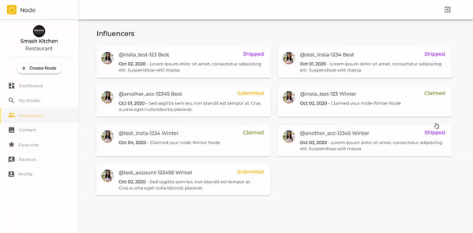

# Node Influencers
This is a web application for the Node App coding challenge. It is created using React(Frontend), Node(Backend), Axios(GET Requests), and Material UI(UI Components).

## Versions Being Used
Node: ``12.18.2``
 
NPM: ``6.14.5``
 
React: ``16.13.1``
 
Axios: ``0.20.0``
 
Material UI: ``4.11.0``

## How to Use
1) Download the repository and navigate inside ``node-influencers-master`` using a console.
2) Run ``npm install`` in console to download all dependancies.
3) Run ``npm start`` in console to start application and click ``http://localhost:3000``.
4) Enjoy!

## App in Action

